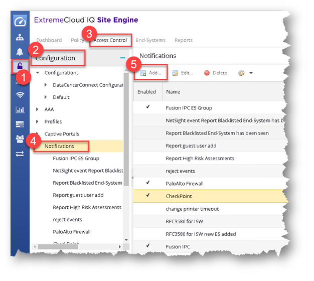
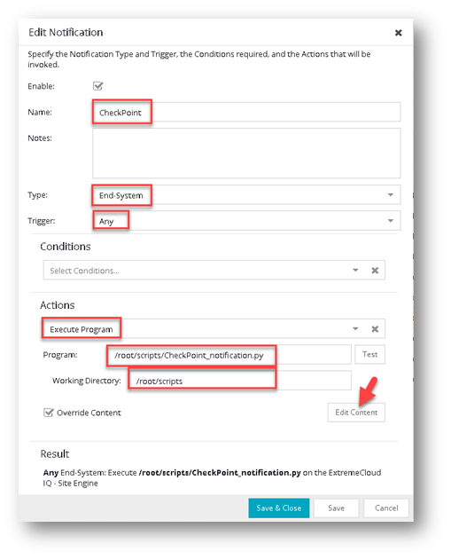

**XIQ-SE Check Point notification with user tags**

this is solution is not official supported by Extreme Networks. You can
not open a GTAC ticket, but you can notify me under
<mnikulski@extremenetworks.com> if you experience issues. I'm voluntary
help you best effort if I can.

Scripts have to be placed on **XIQ-SE** under **/root/scripts/** with
are file\
**CP_notification.py** is the main Python script**\
CP_params.py** contains all parameter for the main script**\
CP_secret.py** contain the CP REST-API secret

The content **CP_params.py** is like this and have to be adapter for the
customer setup.

**HOST = \"192.168.162.88\" \# IP address of the Check Point firewall\
API_TIMEOUT = 3 \# in seconds (default = 3)\
USER_TIMEOUT = 86400 \# in seconds (default = 86400)\
LOG_LEVEL = \'INFO\' \# DEBUG INFO WARN (default = INFO)\
LOG_FILE = \'/var/log/CP_notification.log\'\
BOUNCE_TIME = 10 \# in seconds (default 10) how long a new\
API update for this user will be suppressed**

To authorize the script to use the CP REST API a key is required. This
key have to be generated. On CP site.

1.  Go to Global Settings \> API Keys.\
    The API Keys window opens.

2.  Click New.

    a.  In the Create a New API Key window, select the Service.

    b.  For some services, select the Roles.

    c.  Optionally, enter an Expiration and Description.

    d.  Click Create.\
        The new API Key is generated.

    e.  To keep the new Key pair, click Close.\
        You can always retrieve the Client ID at the API Keys page, but
        you cannot retrieve the Secret Key after you close the window.

The new API Key appears in the table. It includes only the Client ID,
the Identifier for your account and for the client service that uses
this API Key. The password to get access to the Check Point Infinity
Portal (Secret Key) does not appear in the table.

3.  Click Refresh to see the updated information about the API Keys.

You can select an API Key and click Edit to update its expiration period
and description
manually.<https://sc1.checkpoint.com/documents/Infinity_Portal/WebAdminGuides/EN/Infinity-Portal-Admin-Guide/Topics-Infinity-Portal/API-Keys.htm>

The Check Point REST-API key is hosted in **CP_secret.py** and have to
be adapted for the customer setup too.

**SECRET = \"xxxxxxxxx\"**

You can test the scrip via UNIX console like this

**python .\\CP_notification.py
\'state\|ACCEPT,oldstate\|ACCEPT,nacProfileName\|Office,authType\|AUTH_8021X_EAP_PEAP,username\|user,ipAddress\|1.2.3.4,oldipAddress\|1.2.3.4,lastSeenTimeL\|1639572245278,oldlastSeenTimeL\|1639572115000\'**

Please not this is a single like command! Inspect the LOG file like this
to see if all went right

**tail -n 100 /var/log/CP_notification.log**

As next you have to configure a NAC notification.

Got to **Control** -- **Access Control** -- **Configuration** --
**Notification**

{width="5.8786461067366576in" height="5.193396762904637in"}

and add a new record like this

{width="4.673004155730534in" height="5.941493875765529in"}

The default content have to be overwritten. Please push the button
**Edit Content** and provide following string (single line)

**state\|\$state,oldstate\|\$oldstate,nacProfileName\|\$nacProfileName,authType\|\$authType,username\|\$username,ipAddress\|\$ipAddress,oldipAddress\|\$oldipAddress,lastSeenTimeL\|\$lastSeenTimeL,oldlastSeenTimeL\|\$oldlastSeenTimeL**
