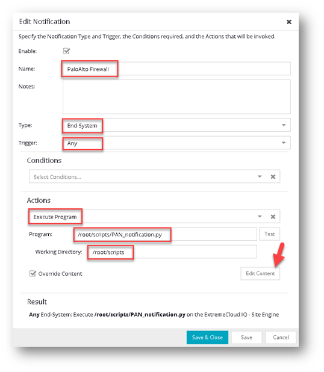

**XIQ-SE Palo Alto notification with user tags**

this is solution is not official supported by Extreme Networks. You can
not open a GTAC ticket, but you can notify me under
<mnikulski@extremenetworks.com> if you experience issues. I'm voluntary
help you best effort if I can.

Scripts have to be placed on **XIQ-SE** under **/root/scripts/** with
are file\
**PAN_notification.py** is the main Python script**\
PAN_params.py** contains all parameter for the main script**\
**

The content **PAN_params.py** is like this and have to be adapter for
the customer setup.

**HOST = \"192.168.162.134\" \# PaloAlto FW\
API_KEY = "xxxxxxxxxxxxxxxx"**

**API_TIMEOUT = 3 \# in seconds**

**USER_TIMEOUT = 7500 \# in seconds**

**LOG_LEVEL = \"DEBUG\" \# DEBUG / INFO / WARN**

**LOG_FILE = \"/root/scripts/PAN_notification.log\"**

**LOG_HOST = \"127.0.0.1\" \# Syslog forwarding (optional )**

**BOUNCE_TIME = 10 \# in seconds**

To authorize the script to use the PAN **API_KEY** a key is required.
This key have to be pulled from the PAN Firewall using XIQ-SE console.
SSH to your XIQ-SE and run follow command using the PAN IP address

**curl -k -X GET
\'https://\<firewall\>/api/?type=keygen&user=\<username\>&password=\<password\>\'**

The response will look like this

**\<response status = \'success\'\>\
\<result\>\
\<key\>LUFRPT1EY0plU1dxTm5oUzJVeXdOWXMvUTYrTUIxMlk9Ri9zTENSZXRWakZ4MmRENVRPVXd4c3BpUWEySjJhbzlSWkdMbUVrU2RIRE9iV05pOWcwSEV6M2lZY1pRdXhGdw==\</key\>\
\</result\>\
\</response\>**

This API Key will remain the same if the user credentials and the source
IP address (XIQ-SE) is the same.

You can test the scrip via UNIX console like this

**python .\\PAN_notification.py
\'state\|ACCEPT,oldstate\|ACCEPT,nacProfileName\|Office,authType\|AUTH_8021X_EAP_PEAP,username\|user,ipAddress\|1.2.3.4,oldipAddress\|1.2.3.4,lastSeenTimeL\|1639572245278,oldlastSeenTimeL\|1639572115000\'**

Please not this is a single like command! Inspect the LOG file like this
to see if all went right

**tail -n 100 /var/log/PAN_notification.log**

As next you have to configure a NAC notification.

Got to **Control** -- **Access Control** -- **Configuration** --
**Notification**

and add a new record like this

The default content have to be overwritten. Please push the button
**Edit Content** and provide following string (single line)

**state\|\$state,oldstate\|\$oldstate,nacProfileName\|\$nacProfileName,authType\|\$authType,username\|\$username,ipAddress\|\$ipAddress,oldipAddress\|\$oldipAddress,lastSeenTimeL\|\$lastSeenTimeL,oldlastSeenTimeL\|\$oldlastSeenTimeL**
